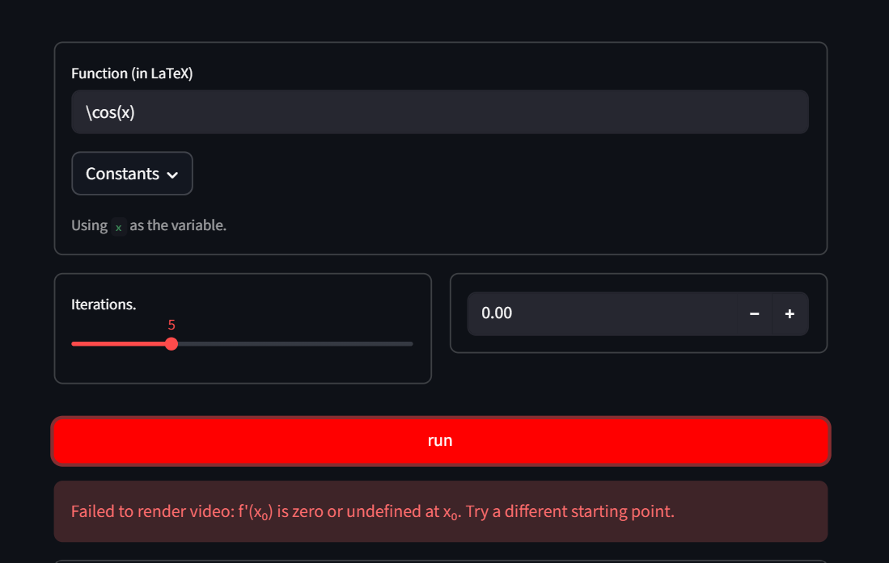

# Newton-Raphson Animation

Streamlit app animating the Newton-Raphson method for a user-supplied
function. Enter a function in LaTeX, a starting point, and an iteration
count, then render the animation as an MP4.

Example animation: (*converted to a gif for the README*)


Input form: 


## Features

- LaTeX input with validation: parse errors, multi-variable functions, and
  undefined starting points are rejected before render

  
  
- Built-in constants

  
  
- Users can add constants via an editable table

  

- Non-blocking and cancellable render

  

- Final answer simplified to closed form where one exists (e.g. `sqrt(2)`,
  instead of `1.41421356...`)

  

## Requirements

- Python 3.10+
- `ffmpeg` on `PATH` (system dependency  `FFMpegWriter` shells out to it directly)
- Python packages: see `requirements.txt`

## Getting started

```bash
pip install -r requirements.txt

streamlit run main.py
```

## Project structure

```
.
├── main.py           # launches GUI
├── gui.py             # streamlit front-end 
├── animation.py        # iteration sequence and matplotlib animation
└── constants.py         # built-in constants
```

## Notes

### Threading model
Running the FFMpeg rendering in the main thread causes the UI to freeze. 
Hence, the`start_render()` spawns the background, or worker, thread to render the animation while the main thread keeps rerunning to display the progress and stay responsive to the "stop" button. 

Streamlit only allows `st.session_state` writes from the main thread tracked via `ScriptRunContext`. 
However, spawned threads from the main thread do not have `ScriptRunContext`. 
Thus, the main thread writes to the plain dict `result_box`. 
The main thread polls for updates through the `render_progress()` function which copies a finished result into `st.session_state` via the `result_box`.

Python threads cannot be killed forcibly from the outside hence cancelling the render is cooperative. 
The main thread calls `set()` if the "stop" button is clicked and periodically, every 0.5 seconds, the worker thread checks the stopping event occurs via `is_set()`.  
FFMpegWriter's `progress_callback` raises a `RenderCancelled` exception to close the writer, close any temporary files and mark the job cancelled in the shared state before exiting the thread function. 
`daemon=True` keeps the workerthread from blocking the process exit.

### Convergence behaviour
Newton-Raphson has quadratic convergence near a root so correct digits roughly double with each iteration. 
For most well-behaved functions, we do not need more than 10 iterations since floats carry 15-17 significant decimal digits. 
The ceiling of 15 is for  slower cases including starting values far from the root. 

#### Tolerances
`_check_stationary_point()` has the arguement `tol=1e-8` for rejecting a derivative too close to zero. 
`_check_convergence()` has the arguement `tol=1e-4` for rejecting a final residual not close enough to zero. 

### Encoding choices
GIF's 256-colour palette produces banding on anti-aliased matplotlib output but H.264 compresses continuous-tone renders way better. 
Since `st.video()` expects a video container, GIF would require `st.image()` and would lose playback controls. 
FFMpeg exposes encoding controls that GIF encoders don't such as `-preset` ultrafast, `dpi=80` for encode speed, and `-pix_fmt yuv420p` for compatibility. 

## Extensions (soon)

3D animation in Manim and/or Newton fractals. 
