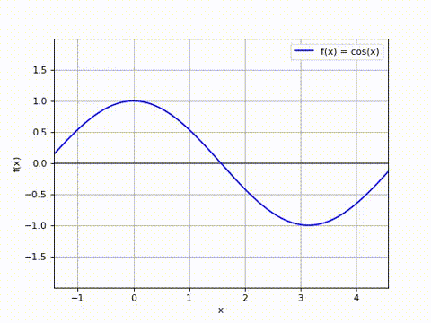
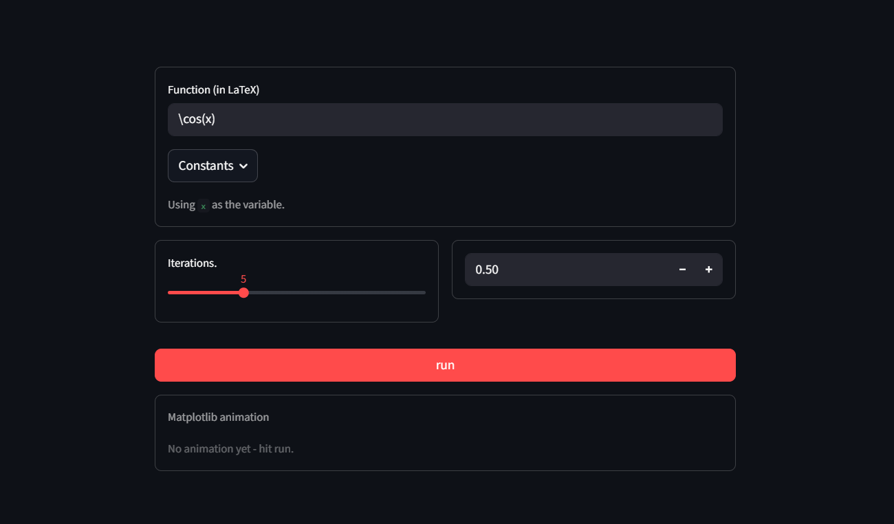
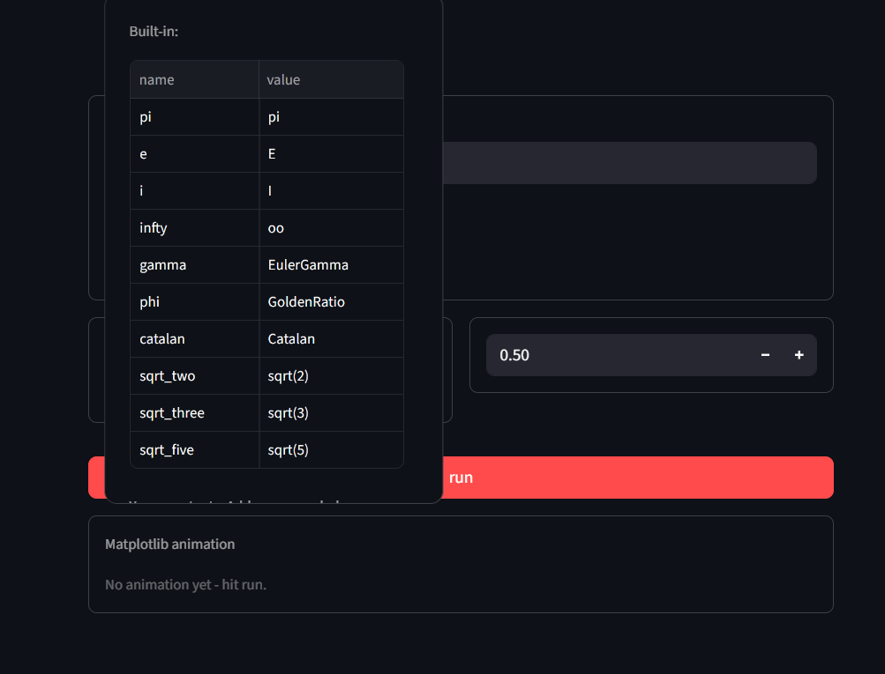
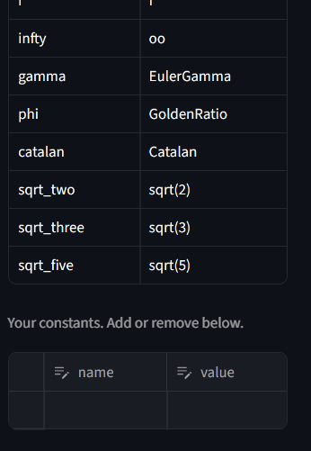
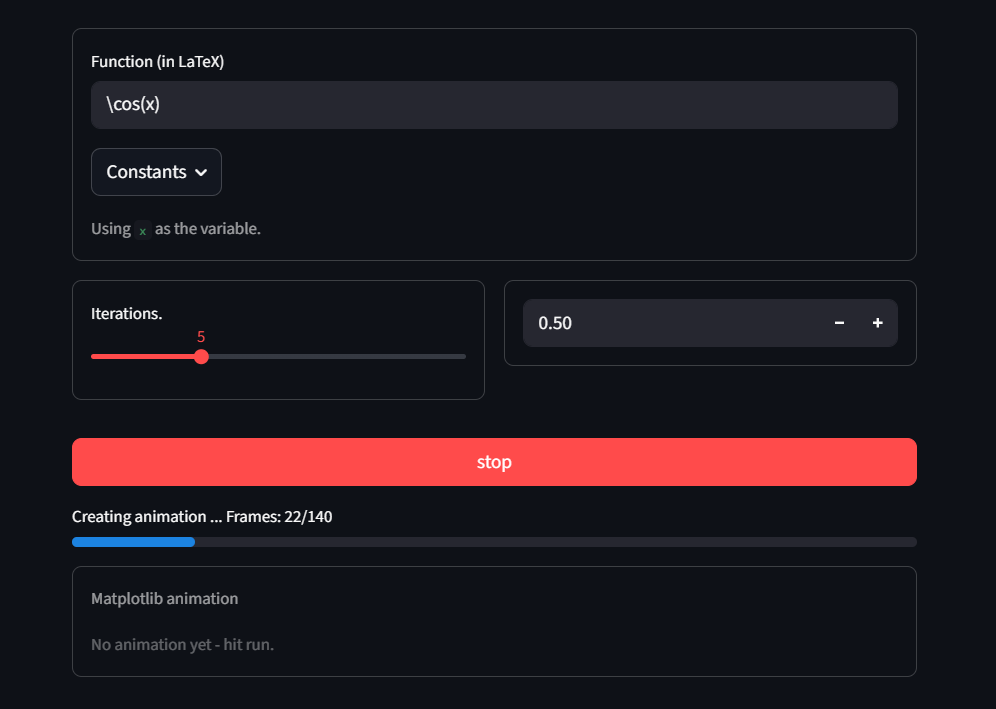
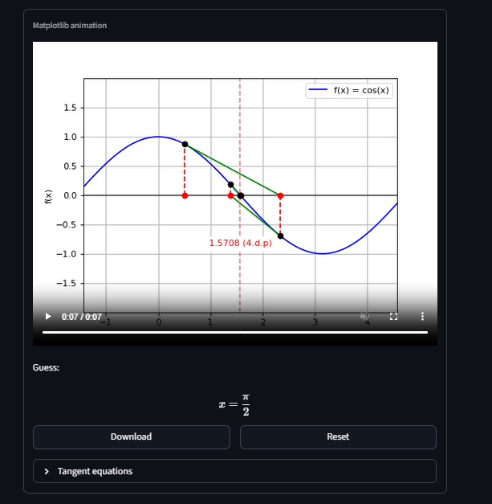

# Newton-Raphson Animation

Streamlit app animating the Newton-Raphson method for a user-supplied
function. Enter a function in LaTeX, a starting point, and an iteration
count, then render the animation as an MP4.

Example animation: (*converted to a gif for the README*)



## Features

- LaTeX input with validation: parse errors, multi-variable functions, and
  undefined starting points are rejected before render

  
  
- Built-in constants

  
  
- Users can add constants via an editable table

  

- Non-blocking and cancellable render

  
  
- Animated tangent-line construction, auto-zoom per step and freeze on final iteration

- Final answer simplified to closed form where one exists (e.g. `sqrt(2)`,
  instead of `1.41421356...`)

  

## Requirements

- Python 3.10+
- `ffmpeg` on `PATH` (system dependency  `FFMpegWriter` shells out to it directly)
- Python packages: see `requirements.txt`

## Getting started

```bash
pip install -r requirements.txt

streamlit run main.py
```

## Project structure

`main.py` 
`gui.py`: streamlit front-end: input form, validation and output
`animation.py`: iteration sequence and matplotlib animation
`constants.py`: built-in constant name to sympy value mapping

## Extensions (soon)

- 3D animation via Manim
- Newton fractals
